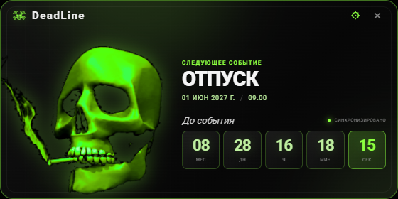
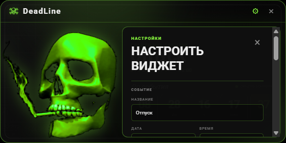

# DeadLine

DeadLine — компактный русскоязычный виджет обратного отсчёта для рабочего стола Windows. Он работает поверх окон, не занимает место на панели задач и показывает событие, оставшееся время и анимированного скелета с дымом.

Автор: [Bulat Reznik](https://github.com/BulatReznik)

## Скриншоты

### Основной виджет



### Настройки



## Возможности

- событие по умолчанию — «Отпуск», 1 июня 2027 года, 09:00;
- обратный отсчёт по месяцам, дням, часам, минутам и секундам;
- несколько вариантов скелетов;
- клик по скелету меняет его цвет случайным образом;
- выбор цвета скелета вручную в настройках;
- тёмная и светлая темы;
- три варианта раскладки счётчика;
- изменение прозрачности и режима «поверх окон»;
- сохранение позиции и размера виджета;
- системный трей и защита от нескольких экземпляров;
- автозапуск вместе с Windows;
- portable `.exe` без Node.js, npm и консольного окна.

## Запуск из исходников

```bash
npm install
npm start
```

Также можно запустить двойным кликом по `start-widget.bat`.

Перетаскивайте виджет за верхнюю панель. Закрытие прячет его в системный трей, а пункт «Выйти» завершает приложение.

## Portable-сборка

```bash
npm run dist
```

Готовый файл появится в `release/DeadLine-1.0.0-portable.exe`. Его также можно скачать из раздела [Releases](https://github.com/BulatReznik/DeadLine/releases/latest). Он запускается на Windows без Node.js, npm и открытого консольного окна.

## Данные

Настройки и положение хранятся локально на компьютере пользователя. Проект не отправляет данные во внешние сервисы.

## Стек

- Electron;
- HTML, CSS и JavaScript;
- локальные изображения и шрифт Roboto;
- сборка через electron-builder.
